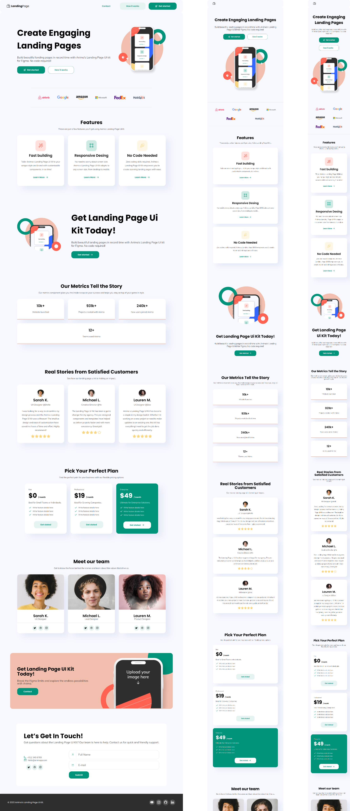

# Animate landing page:
Responsive landing page using the anima figma template. Made with the aim of learning and putting Angular knowledge into practice in creating responsive web applications, reusing components, file structure and Scss

## Screenshot:

## Technologies used:

To get more help on the Angular CLI use `ng help` or go check out the [Angular CLI Overview and Command Reference](https://angular.io/cli) page.